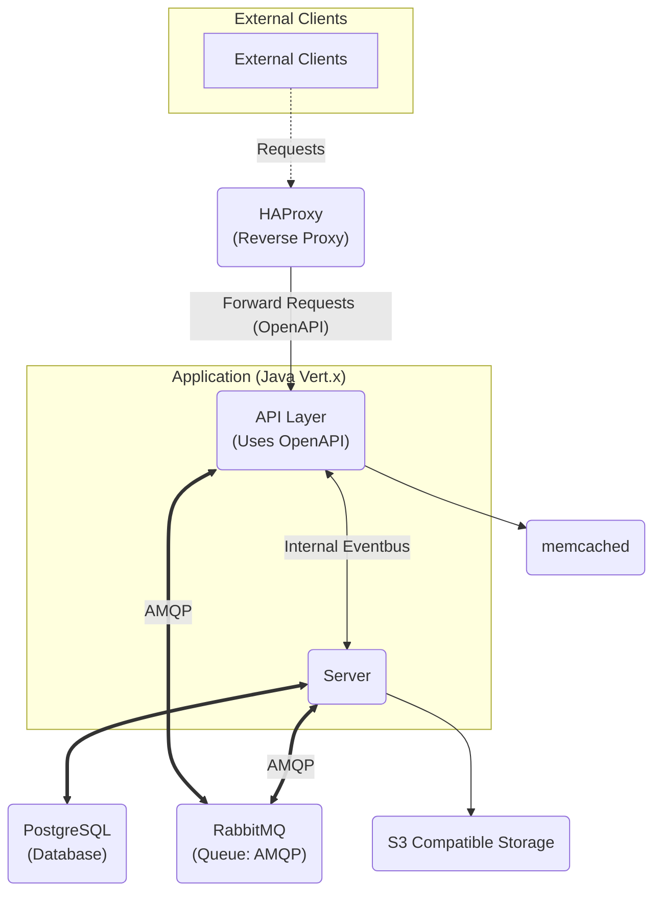

# Njall Design Document

## Introduction

The goal of LarpConnect is to build a system to allow those in our community to solve several problems:

1. The difficulty in broadcasting and recruiting for larps.
2. The lack of common, centralized tooling and the ability to share lessons and tooling between groups and games.
3. How we keep needing to congregate on platforms we don't own, in places we don't own and that will become in part or in whole unsafe for us tomorrow.

We aim to do this in a way that is cost efficient and that allows the centralizing of architecture, but that do not engrave permanently where that architecture is centralized, or require long term maintenance from larp organizations.

In short, we want larp organizers to spend their time organizing larps, not dealing with infrastructure headaches and logistics. 

This is a **technical design document**, meaning that it doesn't focus on the individual features or how to implement them, but rather on the broad strokes about how the infrastructure is designed and needs to be set up.

LarpConnect (codename "Njall") is a multi-single tenant system for connecting disparate communities. It aims to combine a set of features and put them into the hands of the community: 

1. Group coordination and communication. Making it easy to do things like communicate timely information about games (what we use discord for today), pre-game planning and coordination (what we use discord and facebook for), social groups (what facebook gets used for), sending out and customizing characters (what we use email for), surveys and casting (what we use spreadsheets and forms for), etc. 
2. Separate ownership between `Server` and `Studio`, allowing the people who have administrative skills to maintain the infrastructure for many different groups and not requiring every group to have their own IT crew.
3. Federated groups, such that even if a `Studio` is mostly focused on a single `System`, members of that studio or their games may be spread much farther afield. Ultimately we would like to make it easy for a `Studio` to move to a different server, if they desire, and hopefully bring their data with them.
4. Data isolation via a tenancy model, allowing complete wipeout of a studio's information in virtually no time. 
5. Highly scalable and relatively inexpensive to run for the scale of the system.


### Some Limits, Premises, and Terminology

1. A given `server` will likely host no more than 20 (full) studios at a given time. These may be wildly different in size, however. As a limit we will aim to support up to about 50 studios per server out the gate and eventually expanding to 100–200 studios per server around the 2.0 release.
2. A single studio will not host more 200 games a year. We should support up to about 5 times that value as a safety factor
3. A studio may have multiple campaigns. campaigns are groups of games of the same type and they may not have any continuity between them. A single studio will very rarely have more than 5 active campaigns at the same time, though we could theoretically support a relatively high limit here.
4. It should be easy for a `studio` to change `server` and for a user's base 
5. An individual may be a _member_ of a studio or they may be a _participant_ with a studio, with the difference being that the first has a log in and elevated permissions, while the second has a more portable account that may only be aliased locally. 
6. Games will range between 1 and 300 users and 1 and 20,000 participants. We should eventually support up to 500 users per studio and 32,000 participants. These will basically never be _unique_ participants, so participants on a server will not be a linear multiplication of games.
7. A server may also host `user`s. We should support significant numbers of users whose "home base" is a given server (order tens of thousands).
	1. This provides for three types of users:
		- **Primary** users of a server. These are users whose primary account is tied to a server. This is the expected model. If a `studio` in which they are a `participant` moves then their account stays put. They can be reached, for a given server, via `/api/studios/default/v1/users/{user-id}`. These are what we should scale to support tens of thousands of on a given server. We eventually want portability for these in some shape, but not at 1.0. 
		- **Hosted** users. These are users who are part of a **studio**. Their account—and all references—travel with the studio. They are reachable via `/api/studios/{studio-id}/v1/users/{user-id}`. We expect no more than order hundreds of these, and most likely a lot less, per server.
		- **Transient** users. These are users who maintain their own domain. They act functionally like studios but are under the `default` studio.  They do not need to be supported before 2.0.
8. Studios are considered **hosted** studios: we do not fully own them, but rather are hosting them in a server for a time being. 
9. Aliases follow a pattern of `^(?![a-z0-9]*_[a-z0-9]*_)[a-z][a-z0-9_]{5,31}$`.

## Technical Overview

Njall is a reactive java server application that has several layers to it:

1. **API**: The interface to the outside world. A reactive Java application.
2. **Queue**: A high-reliability queue for processing messages that need to be persisted. (RabbitMQ)
3. **Server**: Written in modern Java as a reactive application, currently cohosted in the same system as the API layer.
4. **Database**: A relational database backend. (PSQL)
5. **S3 Compatible Storage**: An S3-compatible blobstore. This can be a self hosted solution or you can just use GCS or S3.

These are the core technologies that we'll use throughout the system. 

In addition, we'll generally expect the following of standard deploys:

1. HA Proxy: Used as a reverse proxy and API gateway. Though theoretically you could bring your own here.
2. memcached. Basically an ephemeral cache. Ultimately we'll want to let users bring their own, but that's much much lower priority.
3. Externalized logging configurations (to allow for, e.g., OpenTelemetry)

These are not a priority while we are in alpha, but will become a priority as we move into beta.

In the future we may have:

1. Apache Solr
2. BigQuery / Redshift

But these are in the distant future after 1.0 and possibly after 2.0.




The following are explicitly out of scope for versions 1.x, but may be considered for future releases:

1. Production AMQP queues other than RabbitMQ. 
2. Production Databases other than PSQL
3. Non-java runtimes
4. Sidekick or external processors
5. Multiapplication execution
6. Separating the API and the backend into separate applications.
7. Alternative reverse proxy configurations
8. OPA integration.
9. Database sharding. 

## Core Design Elements

### Multi-Single Tenant


Everything foundationally assumes a multi-single tenant setup, where there is a single underlying `server` application that is responsible for handling all traffic, but from both an interface and a data perspective everything is kept at least somewhat separate. 

There are several goals in this setup:

1. Data portability. If a `studio` wants to move to a different `server` they should be able to do so with minimal hassle. This is going to be a pain to set up, but a multi-single tenant design makes it "painful to set up" and not "impossible to retrofit in." nb: Minimal hassle may include downtime for writes. We're explicitly not guaranteeing how long a studio may be unavailable for writes in 1.0 since it requires behavior from three separate parties: the origin server, the target server, and the studio. We may polish this and make it smoother for version 2.0, however, and the problem isn't intractable if everyone behaves using temporal diffs and similar.
2. Wipeout. If a `studio` wants their data wiped out they should be able to do so easily and with minimal risk to other tenants. 
3. Data separation. This has both pragmatic benefits from the standpoint of performance as well as helping prevent data from "leaking" between two different studios.
4. Efficiency. One of the major challenges with current ActivityPub systems is that they are fundamentally inefficient. Having a multi-single tenant setup allows for the conceptual, consumer-level separation while at the same time allowing the sharing of the heavyweight resources (such as the database)

The ultimate goal here is that let's say you have two larp studios at two different addresses. They can have `larpstudio.com` and `larpclan.com`. They can share a single backend infrastructure while maintaining separate identities, or delegate part of their hosting over to `api.larpstudio.com` or `social.larpclan.com` while maintaining the rest of the website on their own. Regardless, these two then share an identical backend setup: a single LarpConnect server.

### ActivityPub "The Good Parts" aka (Proto)FeatherPub

We are implementing a scaled-down version of ActivityPub based loosely on a design for FeatherPub systems. The goal of FeatherPub is to be broadly compatible with ActivityPub, but with a few core differences:

1. JSON-only, no JSON-LD. `@context` headers are provided for backwards compatibility and to mark which "plugins" are supported by the system, but not as JSON-LD context objects.
2. Strict JSON validation with OpenAPI. We expect JSON payloads to look a certain way and be modified in specific, specified ways and we will behave the same when talking to others. This approach will also emphasize having a single typesafe type that is cleanly expressed, e.g., rather than accept `"type": "Actor"` or `"type": ["Actor"]` or `"type": ["Actor", "User"]` or leaving out type altogether, we instead emphasize having a single, canonical, correct way to specify what you intend. 
3. `Activities` will not have active URI `id` values that resolve (as would typically be required by AP). These are reserved for `Object` and `Link` objects. They will have unique identifiers, however. 

While we are borrowing inspiration from several places around the Fediverse and designed to federate, this is **explicitly _not_ a Fediverse application** and we have no expectation of compatibility with the rest of the fediverse. Thus we will not be supporting, e.g., the outdated version of HTTP Signatures that are widely used.

### We Dictate, But Do Not Control, The Architecture

We have made choices with the intention that it can scale both up **and** down. From a single studio server to a massive server that manages most studios in the world. The goal is for this to be as low hassle as possible, while still giving you control of the system.

As such, we don't have an endlessly configurable system, but we _have_ incorporated a degree of modularity, emphasizing specific key systems. So if you have a modern version of PSQL, a modern AMQP queue, etc then you are basically good to go and should be able to manage things on your own. 

We **are** intending to keep things relatively modern, so expect us to track or even be a solid step in front of the long-term-support versions (as applicable). Once a LTS version is no longer supported, expect us to require an upgrade, but we may always require an upgrade before that point. This goes for basically all dependencies.

To start with, we will recommend the following:

- JRE 26+ (and require 25+)
- PSQL 18+ (and require 17+)
- RabbitMQ 4.3+
- memcached 1.6+
- A remote cloud blobstore (e.g., GCS), or SeaweedFS 4.24+

Earlier development versions may target earlier versions of these software components and we may update the final numbers depending on the development cycle. 

## Deployment

We'll deploy the infrastructure using docker-compose. For production environments we'll provide documentation or tools to simplify for people who are, e.g., already running a PSQL instance or are using a service like CloudSQL.

We will also provide recommended configurations for memcached, PSQL, HA Proxy, etc. 

## API


### Path Layout

There are a few foundational base paths that manage the entire API surface:

- `/` — This is where `.well-known` lives and… not a lot else. Routes at this level are for things like the frontend web service.
	- `/.well-known` — RFC 5785
		- `/.well-known/webfinger` — Webfinger support under RFC 7033.  This will go against the admin's tenant registry to determine the correct tenant to route to.
		- `/.well-known/nodeinfo`— The `nodeinfo` payload. Only 2.2 is supported.
		- `/.well-known/security.txt` — RFC 9116. Follow the basic `security.txt` framework for informing others about who to contact in the event of a security problem. 
		- `/.well-known/oauth-authorization-server` — To redirect to the authorization endpoint, per RFC 8414.
- `/api/admin/v1` — Where basic admin functionality lives.  Things like adding new studios, querying metadata about studios, etc.
	-  `/api/admin/v1/oauth/(authorize|token)` —  Standard oauth logins for admin functions (note that these are completely separated from the tenant ids: if you are doing a global admin action you need to be separately registered).
	- `/api/admin/v1/studios[/{studio-id}]` — Accessing basic information about studios, creating a new one. 
	- `/api/admin/v1/users[/{user-id}]` — The users for the `server`. Can query individual tenants or create new ones. 
- `/api/server/v1` — The home for a lot of **public** facing resources. Things like key lookups, the actual `nodeinfo` URI that you'll be directed to by `.well-known/nodeinfo`, etc. Resources under `/api/server/v1` are considered public to other servers that may exist.
	- `/api/server/v1/health` — Health status for the system. Amount of information returned depends on if you are logged in. 
	-  `/api/server/v1/webfinger` — The primary webfinger endpoint. `/.well-known/webfinger` points here. Takes a `resource` argument. 
	-  `/api/server/v1/nodeinfo` — The primary nodeinfo endpoint. `/.well-known/nodeinfo` points here.
- `/api/studios/{studio-id}/v1` — The tenant setup. The `{studio-id}` may take one of two forms: A lowercase alphanumeric string that starts with a letter and may contain underscores. This represents an `alias` for the underlying resource (e.g., `my_org`) **OR** A base36 representation of a UUID, split into the upper and lower halves with a `-` between them. By default, `default` and `server` are reserved aliases. 
	- `/api/studios/{studio-id}/v1/oauth/(authorize|token)` — Standard oauth support endpoints, tenant scoped. 
	- `/api/studios/{studio-id}/v1/entities[/{entity-id}]` — Entity manipulation, this is the primary entry point for manipulating information that links back through the CTI.
	- `/api/studios/{studio-id}/v1/actors[/{actor-id}[/(inbox|outbox)]]` — The control paths for the actors.
	- `/api/studios/{studio-id}/v1/systems[/{system-id}]` — The systems for a given studio.
	- `/api/studios/{studio-id}/v1/campaigns[/{campaign-id}]` — The campaigns being run by a given studio. Campaigns represent multiple games that are part of a single series. They may be episodic or serialized, or multiple runs of the same game, and studios may bring their own definition to the table. 
		- `/api/studios/{studio-id}/v1/campaigns/{campaign-id}/games[/{game-id}]` — Represents individual games. A game is a single event being run under a campaign. 
			- `/api/studios/{studio-id}/v1/campaigns/{campaign-id}/games/{game-id}/instances[/{character-instance-id}]` — Characters exist independent of games, but when they are brought into a game this is referred to as an _instance_.
		- `/api/studios/{studio-id}/v1/campaigns/{campaign-id}/characters[/{character-id}]` — Characters can also exist as part of campaigns. 
	- `/api/studios/{studio-id}/v1/users[/{user-id}]` — Users are `individuals` who have a localized account. 
	- `/api/studios/{studio-id}/v1/operations` — For following up on long-running operations. 

### Filtering

When filtering we will use either [AIP-160](https://google.aip.dev/160) (a subset of CEL) or full [CEL](https://cel.dev). The specifics here vary by the API and its intent. 

### Studio IDs

It should be noted that internal to the application there are two UUIDs for each studio:

1. The **public** UUID, which is a UUIDv4 and acts as a unique identifier for the studio on that server. This is called the `studio-id`
2. The **private** UUID, which is a UUIDv7 and is what is used in the database tenant identifier.  This is called the `tenant-id`

This is done to provide a little obscurity and we will go more into what is happening here and why in the Database section. 

### Aliases

As a **general rule** aliases are considered unique within their context. Which is to say: an alias for a studio is unique for a server, an alias for a user is unique to the studio. Aliases within their context should not be considered **immutable** but rather as **durable**. What we mean by that is:

1. A resource may have multiple aliases.
2. You may _add_ aliases. This fits with (1): you can have multiple aliases, so of course you can add another one. 
3. An alias may be _retired_ so that it is no longer functional. When this happens it will break all attempts to use it externally, so persistent ids should favor using the internal UUID representations. If it is retired then the endpoint **SHOULD** return `410 Gone`
4. A retired alias **SHOULD NOT** be reused within its scope. So if a studio is aliased to `foobar` and that is retired there should never be another `foobar` that maps to a different studio on that server. Servers **MUST NOT** depend on this behavior, however: always _confirm_ that a server is the same, don't assume that it is because it is using the same alias.

### Implemented Methods and Paths

When available, the following formats are used, with the caveat that not ever endpoint will implement every option. 

- Get (single): `GET */{id}`
- Get (list): `GET *`
- Get (batch): `GET *:batchGet`
- Create (single): `POST *`
- Create (batch): `POST *:batchCreate`
- Update (single): `PATCH */{id}` **OR** `PUT */{id}`
- Update (batch): `POST *:batchUpdate`
- Delete (single): `DELETE */{id}`
- Batch deletion: `DELETE *:batchDelete`

### Mapping the flow


#### Writing to the Outbox

For a hosted user or a transient user, it would look like this:

1. A user—username `foobar`—wishes to create a Note for their larp.
2. They create an `Activity` (specifically `Create`) locally on their system.
3. They send this object to their user outbox: `https://api.example.com/v1/actors/foobar/outbox`.
4. Their browser resolves this address from DNS (CNAME) and sends it to a different location: `larpconnect.app`.
5. HA Proxy intercepts this request and rewrites it to `http://larpconnect.app/api/studios/example/v1/actors/foobar/outbox`
6. The server's API layer sees this and validates the JWT (from the client) and then confirms that `api.example.com` is a registered and validated hostname that connects to the `example` studio. It also confirms that the structure of the call matches its own internal OpenAPI design.  As part of this it will also turn the alias (`example`) into a UUID.
7. Seeing that everything looks good it passes this on to an API handler verticle, which uses the API's path and the UUID to pass the request on to a verticle for the Actor's outbox.
8. This verticle writes it out to the queue and sends back over the event bus to return `Accepted` to the caller.
9. Later another verticle will reap the queue and pull off the object and send it to a specialist verticle that is aligned with the `studio`.
10. The specialist verticle will then examine the `Activity`, extract the `object`, and write the results to the database (after performing safety checks, etc).
11. When it is done the verticle let the queue verticles know whether to `Ack` or `Nack` the message. The message is now available in the `outbox` and has been processed by the system.

Since participants have their own actors hosted elsewhere, they of course do not follow this flow: they _participate_ in a studio and will receive messages forwarded to the certain actors in the studio, but aren't owned by either the studio or (necessarily) the server.

For a server's **primary** users, we'd expect them to go directly to the `server`'s website, which may or may not be identical to the `server`'s hosting, e.g:

1. A user—username `foobar`—wishes to create a Note for their larp.
2. They create an `Activity` (specifically `Create`) locally on their system.
3. They send this object to their user outbox: `https://api.larpconnect.com/v1/actors/foobar/outbox`.
4. This gets rewritten by HA Proxy to: `https://larpconnect.app/api/studios/default/v1/actors/foobar/outbox`
etc

## Data

The primary database is PSQL.  It is divided into the follow schemas:

- `njall_base`: Represents common configuration elements for the entire system. Visible to all tenants and doesn't contain tenant-specific data, this is designed to be functionally immutable from the perspective of the tenants and can be cached rather than joined against.
- `njall_admin`: The central admin database. Stores information for configuring the individual studios. From the perspective of the tenants this is immutable and retrieved from in-memory caches.
- `njall_users`: The database for tenants. 

Each individual larp studio has enforced row-level security. There is a lookup table in the `njall_admin` schema that can be used with either an alias or a UUIDv4 `studio-id` in order to locate the name of the tenant identifier. When exposed to the public, the `studio-id` is always in the form `base36(upper-bits)-base36(lower-bits)`. 

Because, from the perspective of the individual tenants, the `base` and `admin` schemas are functionally immutable (in practice, in truth they are not immutable but eventually consistent and read from a cache) there should be no cross-schema joins required in normal operations and there is no global referential integrity between these. 

The database tables that need to handle ActivityPub objects are based around a common table inheritance pattern. This is only relevant for the user tenants. 

### Tenancy

We enforce **row level security** in order to keep users within a single domain unless they explicitly have permission to be outside of it. That policy might look something like this:

```plsql
-- 1. Enable RLS on the target table
ALTER TABLE users ENABLE ROW LEVEL SECURITY;

-- 2. Create a policy that evaluates the session variable
CREATE POLICY tenant_isolation_policy ON users
    AS RESTRICTIVE
    USING (tenant_id = NULLIF(current_setting('app.current_tenant_id', true), '')::uuid);

```

Using row level security to enforce this **does** make it harder to pull off full migrations, and that's something we'll need to keep an eye on, but that's also a rarer situation.

### Versioning

The database and the individual schemas are versioned using flyway.

### UUID Usage

For the most part IDs in the system are synthetic UUIDv7 values, allowing for more efficient indexing. For the most part these are both the public id and the internal id. The exceptions are as follows:

1. The `studio-id` is a specially formatted UUIDv4. This is to assist in portability and also to prevent the age of the larp studio's account from being revealed in the id. 
2. In a few places we use **natural** keys. These are the exception, but they do come up.
3. A handful of other cases where the creation time should not be leaked (e.g., individual contact ids), especially if the use case has a relatively low number of rows and we do not typically transmit it over the wire with a date already attached.

The UUIDs facilitate building descending indices, making it easier load data and to query it.

For the sake of convenience, UUIDs are generally expressed in base36 when used as part of the URI. So instead of `147b7cbd-c761-4d2a-924f-70a3f221b309` you would see `0b7oelbwyvksg-283kbqn9bmkg0` (or whatever). This was chosen for a few reasons:

- It's a little shorter (exactly 27 characters) while still being case insensitive. 
- It can be stored in a DNS subdomain prefix, if need be. This is unlikely to ever be exposed to the user in practice, but it could show up in backend routing.
- It's cleanly distinct from labels. 


## General Elements

### Tenancy

Every studio is considered its own _tenant_. In this setup, one system manages the overall overarching system, but the tenants data is kept separate and there's some separation in the processing (using separate verticle instances for separate tenants, using separate queues), making it harder for a single bad actor to overwhelm the system. 

Note that these separate verticles are not separate _vertx_ instances: they share a single vertx instance, but just have a separate verticle. This allows for better error isolation, circuit breakers, etc. In the future we may split into a few different worker instances, but at least for 1.0 we'll be focusing entirely on a single vertx instance per application. 


### Security Components

1. Communication (both C2S and S2S) predominately uses JWTs for APIs. OAuth2 is the primary method for users to talk to a server. We completely eschew HTTP Signatures in this model.
2. JSON messages are transmitted S2S with a JWT signature (RFC 7523).
3. CORS is enabled. 
4. CSRF tokens.

### Testing

Testing is accomplished via a mix of:

- `vertx-junit5`
- JUnit 6
- Cucumber
- Testcontainers

The goal is to have 90+% branch coverage and 85+% instruction level coverage, with every API surface covered by Cucumber testing.  We can get to that number via a mix of mock, integration, and e2e tests. 


## Roadmap

These mark any entry requirements and general state notes:

- Alpha: Bootstrapping development. 
	- All development activities before beta. Unstable. 
	- The primary goal of alpha is to get to the point of having a running system where we can focus on feature work. 
- Beta: Feature work and server ecosystem.
	- Requires finalization of HA Proxy, memcached, and externalized logging before entry. These being finished is basically the final move from alpha into beta.
	- Must be a runnable server that has some basic functionality, with generally functional APIs.
	- Still unstable. APIs may break at any time and deploying will always assume a fresh install. 
	- The goal of beta is to get to the point where the underlying setup is stable. 
- 0.5: C2S and database versioning
	- Basic API is finalized and C2S API is implemented. S2S may be implemented but without full federation enablement (we may accept messages, but are unlikely to be sending them).
	- Security features that aren't related to things like DDoS and server overloads are enabled to the degree where we are comfortable with this living on the internet for extended periods, so long as you are comfortable dealing with crashes and such. Basically: it should work, but we don't guarantee how well. 
	- Semi-stable. Beta APIs may change between point releases still, but database changes will now be versioned and we will assume an upgrade path rather than a fresh install. APIs probably won't be out of beta yet in 0.5, but we may start moving APIs out of beta for future point releases, at which point they will no longer be prone to chaotic changes. 
	- Functional admin API.
	- The goal of the point releases is to allow testing upgrade paths, stress testing, and seeing how the system runs over time.
	- Marks the beginning of developing a UI application. 
	- nb. The database versioning from this point forward will be based on flyway, but **only between point releases**. So if you have 0.6b1 and 0.6b2 comes out you should not expect an upgrade path except from 0.5.
- 1.0: Full S2S release
	- Full first release. 
	- Requires full, programmatic support for wipeout. 
	- Requires a UI.
	- `FEDERATION.md` is created and filled out.
	- Requires integration with S3. We will not specify which one you should use (AWS S3, GCS, or self-hosted) but sometime during 1.x we may include installation and configuration architecture for SeaweedFS.
	- Requires all major functionality to be out of Beta.
	- We should aim for email integration if not by 1.0 then sometime in the early 1.x period.
	- The goal of 1.x is to be a usable platform for a small number of federated servers, hosting a few dozen studios each, with a larger number of primary  users per server.
	- Despite set upgrade path will require a fresh install from the 0.x line. This is the last time we should require a fresh install for any major version release.
- 2.0: Cross-system compatibility and increased flexibility.
	- Publishing FeatherPub as a full protocol is a goal, with development starting in 2.0 and running throughout 2.x.
	- Development of an analytics system has begun, has Beta APIs, and will be finished throughout the 2.x releases.
	- A goal of 2.x releases may be broader federation capabilities, so supporting ActivityPub compliant servers more closely (while still not compromising on our own type safety or philosophy). This is uncertain but if we decide to do this it would be done throughout the 2.x releases. 

## Open Questions

1. UI. We should have something of a UI for the 1.0 release and not depend on client applications for everything, preferably in the form of a SPA. We should start developing this in 0.5 and will need to decide on the underlying framework. Maybe Vue 3 + Pinia + Vite. This will require more thought. 
2. It may be better to ultimately settle on a schema-per-tenant model, or do a hybrid model. This will need more consideration. 

## Alternatives Considered

### Providing options for file system deployment

This is classically something that a lot of Fediverse applications provide: the ability to use local disk or some equivalent. This is the default in [mastodon](https://docs.joinmastodon.org/user/run-your-own/#so-you-want-to-run-your-own-mastodon-server) and is an option in [Pleroma](https://docs-develop.pleroma.social/backend/configuration/cheatsheet/#uploaders), by way of example. It makes testing easy and can be nice for getting started.

Unfortunately, it runs into multiple bottlenecks:

1. It makes it extremely difficult to move to an object storage later.
2. It makes it harder to do full user migrations to different servers.
3. It creates a (default) configuration that is against already established best practices.

As a result of trying to avoid this, and limiting the testing surface at the same time, Njall requires an object store right out of the gate. It requires a little more work up front, to avoid a lot of headaches in the long run. 

### JSON-LD

We **could** do this with full support for JSON-LD, but this:

1. Creates a functionally infinite testing surface with multiple security considerations. These obstacles may be surmountable, but they are a PITA.
2. Are difficult to validate for correctness, and behavior here varies between clients that accept on JSON but _pretend_ to accept JSON-LD (most of the Fediverse) and those that fully support JSON-LD. 
3. It's easier to handle plugins and extensions through more standard methodologies for this, as opposed to supporting the layered complexity of JSON-LD.
### HTTP Signatures

Most of the fediverse uses HTTP Signatures, and specifically an [outdated draft](https://datatracker.ietf.org/doc/html/draft-cavage-http-signatures) of the [HTTP Signatures](https://datatracker.ietf.org/doc/rfc9421/) specification. With Njall we've deliberately decided to go in a different direction: Using [JWTs](https://datatracker.ietf.org/doc/html/rfc7523). 

This has several advantages:

1. It is more widely used as a standard. HTTP Signatures is a relatively obscure specification outside of the fediverse, and the outdated draft of it is more so.
2. It is transferrable in a way that HTTP Signatures are not, allowing for chain of custody designs.
3. It allows for cleaner separation of the API layer from the server.

### Why not just implement ActivityPub fully?

Have you ever built an actual, serious, production quality ActivityPub server? Especially for a use case that is something other than microblogging?

Sure. You can do it. But.

Yeah. No.

More seriously: this is a test bed for some ideas we have on how to make ActivityPub better and more tolerable, and we're willing to sacrifice short term federation with others—especially those servers whose use cases do not resemble ours—in order to have something more robust that we can potentially publish in a future version.

### Why Federate at All?

A few reasons:

1. Federation makes it easier for server operators to bear the potential system load. 
2. It helps avoid centralization of power beyond a certain point. While there will always be major centers of gravity, federation gives others the ability to come in as peers.
3. In the long run it opens up the possibility of connecting into systems like Bluesky or the ActivityPub network, possibly with a translation layer or multiple adaptions/bridges on one or both sides, but possible.  This is particularly relevant for connecting to services like [Mobilizon](https://mobilizon.org) and groups like the [threadiverse](https://joinfediverse.wiki/Threadiverse), which have obvious applications for larp.

## References

### RFCs

The LarpConnect ("Njall") architecture achieves high-assurance security and dynamic discovery by adhering to the following Internet Engineering Task Force (IETF) RFC standards:

*   **RFC 5785 (Well-Known URIs)** — Defines the path prefix framework (`/.well-known/`) used securely across tenant domains for site-wide discovery routing.
    *   *Reference:* Nottingham, M., Hammer-Lahav, E. (2010). *Defining Well-Known Uniform Resource Identifiers (URIs)*. RFC 5785, Internet Engineering Task Force.
    *   *URL:* https://www.rfc-editor.org/info/rfc5785
* **RFC 6265bis (Cookies: SameSite Attribute)** — Specifies browser-level context restrictions for state-carrying headers during third-party interaction events.
    * *Reference:* West, M., Barth, A. (Active Draft). *Cookies: SameSite Attribute*. Internet Engineering Task Force.
    * *URL:* https://datatracker.ietf.org/doc/html/draft-ietf-httpbis-rfc6265bis
* **RFC 6454 (The Web Origin Concept)** — Establishes the mathematical bounds of an origin identifier (scheme, host, and port) used by the API edge to validate multi-tenant access boundaries.
    * *Reference:* Barth, A. (2011). *The Web Origin Concept*. RFC 6454, Internet Engineering Task Force.
    * *URL:* https://www.rfc-editor.org/info/rfc6454
*   **RFC 6749 (The OAuth 2.0 Authorization Framework)** — Governs the core protocol lifecycle, explicitly utilizing the Authorization Code Grant for user contexts and the Client Credentials Grant for trusted clusters.
    *   *Reference:* Hardt, D. (Ed.). (2012). *The OAuth 2.0 Authorization Framework*. RFC 6749, Internet Engineering Task Force.
    *   *URL:* https://www.rfc-editor.org/info/rfc6749
*   **RFC 7033 (WebFinger)** — Provides the formal protocol framework for account identity lookups and public resource resolution across distinct administrative boundaries.
    *   *Reference:* Jones, M., Salgueiro, G. (2013). *WebFinger*. RFC 7033, Internet Engineering Task Force.
    *   *URL:* https://www.rfc-editor.org/info/rfc7033
*   **RFC 7519 (JSON Web Token)** — Normatively specifies the data layout, claims structure, and tamper-resistant state parameters used for short-lived stateless API bearer access tokens.
    *   *Reference:* Jones, M., Bradley, J., Sakimura, N. (2015). *JSON Web Token (JWT)*. RFC 7519, Internet Engineering Task Force.
    *   *URL:* https://www.rfc-editor.org/info/rfc7519
*   **RFC 7523 (JWT Profile for OAuth 2.0 Client Authentication)** — The core cryptographic baseline for low-trust Server-to-Server (S2S) federation, allowing remote instances to dynamically exchange signed assertions for local API access tokens.
    *   *Reference:* Jones, M., Campbell, B., Mortimore, C. (2015). *JSON Web Token (JWT) Profile for OAuth 2.0 Client Authentication and Authorization Grants*. RFC 7523, Internet Engineering Task Force.
    *   *URL:* https://www.rfc-editor.org/info/rfc7523
*   **RFC 7636 (PKCE Protection)** — Mitigates runtime authorization code interception flaws during client application interactive authorization loops.
    *   *Reference:* Sakimura, N. (Ed.), Bradley, J., Agarwal, N. (2015). *Proof Key for Code Exchange by OAuth Public Clients*. RFC 7636, Internet Engineering Task Force.
    *   *URL:* https://www.rfc-editor.org/info/rfc7636
*   **RFC 8414 (Authorization Server Metadata)** — Provides the standardized JSON metadata structure hosted at the discovery edge to dynamically publish versioned endpoints.
    *   *Reference:* Jones, M., Sakimura, N., Bradley, J. (2018). *OAuth 2.0 Authorization Server Metadata*. RFC 8414, Internet Engineering Task Force.
    *   *URL:* https://www.rfc-editor.org/info/rfc8414
* **RFC 9116 (A File Format to Aid in Security Vulnerability Disclosure** — Specifying the structure of security.txt
	* *URL:* https://www.rfc-editor.org/info/rfc9116/


### Misc Security and Site Isolation References

To ensure deterministic runtime guarding against side-channel exploits and unauthorized state cross-execution, the platform aligns with the following web security standards:

* **OWASP CSRF Prevention Blueprint** — Provides the formal architectural specifications for implementing cryptographically bound Synchronizer Token and Double Submit Cookie patterns.
    * *Reference:* OWASP Foundation. (Continuous). *Cross-Site Request Forgery Prevention Cheat Sheet*. 
    * *URL:* https://cheatsheetseries.owasp.org/cheatsheets/Cross-Site_Request_Forgery_Prevention_Cheat_Sheet.html
* **WHATWG Fetch Standard (CORS Subsystem)** — The active standard defining the handling mechanics of preflight requests, origin authorization evaluation lists, and client credential isolation flags.
    * *Reference:* WHATWG. (Continuous). *Fetch Living Standard: Cross-Origin Resource Sharing*.
    * *URL:* https://fetch.spec.whatwg.org/#cors

### W3c

The data structures, entities, and message schemas in the LarpConnect ("Njall") platform are derived from the foundational W3C Social Web standards. While the system implements a constrained, strictly monomorphic, non-JSON-LD application profile ("FeatherPub"), it maintains structural lineage with the following specifications:

*   **W3C Activity Streams 2.0 (Core)** — Defines the core abstract model and serialization serialization format for social data.
    *   *Reference:* Prodromou, E., Snidell, J. (Eds.). (2017). *Activity Streams 2.0*. W3C Recommendation. 
    *   *URL:* https://www.w3.org/TR/activitystreams-core/
*   **W3C Activity Vocabulary** — Defines the normative taxonomy of explicit Actor, Object, and Activity types (e.g., `Create`, `Note`, `Actor`).
    *   *Reference:* Prodromou, E., Snidell, J. (Eds.). (2017). *Activity Vocabulary*. W3C Recommendation.
    *   *URL:* https://www.w3.org/TR/activitystreams-vocabulary/
*   **W3C ActivityPub** — The decentralized social networking protocol defining the logical routing paradigms for Client-to-Server (C2S) Outboxes and Server-to-Server (S2S) Inboxes.
    *   *Reference:* Tallon, C., Guy, A. (Eds.). (2018). *ActivityPub*. W3C Recommendation.
    *   *URL:* https://www.w3.org/TR/activitypub/

### FEPs and Community Group Reports

In addition to the above, we draw inspiration from and will adapt the following FEPs and W3c community group reports into FeatherPub, though we will play faster and looser with those marked `DRAFT` than those marked `FINAL`, we will strive to document any differences or deviations from these FEPs in our implementation. 

#### FEPs

- **FEP-d556: Server Level Actor Discovery Using Webfinger** — This will be heavily adapted to accommodate our multi-single tenant pattern. 
	- *URL:* https://fediverse.codeberg.page/fep/fep/d556/
- **FEP-67ff: FEDERATION.md** — We'll clearly document how to federate with us, even though for 1.0 we don't expect anyone to do so.
	- *URL:* https://fediverse.codeberg.page/fep/fep/67ff/
- **FEP-1b12: Group Federation**
	- *URL:* https://fediverse.codeberg.page/fep/fep/1b12/
- **FEP-baf5: Administrator Collection**
	- *URL:* https://fediverse.codeberg.page/fep/fep/baf5/
- **FEP-f228: Backfilling Conversations**
	- *URL:* https://fediverse.codeberg.page/fep/fep/f228/
- **FEP-f15d: Context Relocation and Removal**
	- *URL:* https://fediverse.codeberg.page/fep/fep/f15d/
- **FEP-11dd: Context Ownership and Inheritance**
	- *URL:* https://fediverse.codeberg.page/fep/fep/11dd/
- **FEP-8a8e: A common approach to using the Event object type**
	- *URL:* https://fediverse.codeberg.page/fep/fep/8a8e/

Despite being withdrawn, we may also consider adopting or picking up to resubmit:

- **FEP-612d: Identifying ActivityPub Objects Through DNS**
	- *URL:* https://fediverse.codeberg.page/fep/fep/612d/

#### Community Group Reports

- **ActivityPub and WebFinger**
	- *URL:* https://www.w3.org/community/reports/socialcg/CG-FINAL-apwf-20240608/


