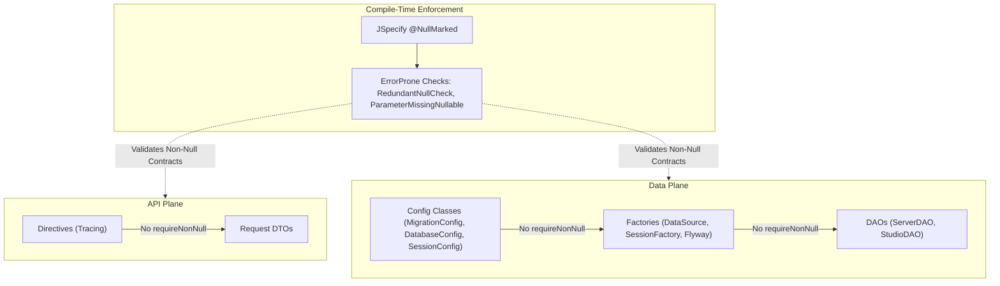

## Context

Under [ADR-0019](../../../../adr/0019-static-nullity-enforcement-and-constructor-streamlining.md), **Njall** introduced ErrorProne static compile-time checks (`AddNullMarkedToPackageInfo`, `ParameterMissingNullable`, and `RedundantNullCheck`) and eliminated redundant runtime null checks inside domain record constructors.

However, defensive runtime checks (`Objects.requireNonNull` and `param == null` branches) and corresponding unit tests asserting `NullPointerException` still remained across configuration models, factory implementations, **DAO** classes, and **API plane** directives. In a codebase where `@NullMarked` is universally declared across all packages, these unannotated fields and parameters are contractually guaranteed to be non-null by the compiler. Retaining redundant runtime checks creates dead branches, clutter, and false unit tests that simulate impossible states.

This design generalizes compile-time nullity guarantees across all layers of **Njall**, establishing that runtime null checks and NPE tests are strictly prohibited on parameters and fields unless explicitly marked with `@Nullable`.

### Architectural Component Diagram

## Goals / Non-Goals

**Goals:**
- Eliminate defensive runtime null checks (`Objects.requireNonNull`) across all configuration classes, service and resource factories, **DAO** methods, and **API plane** directives where parameters are not marked `@Nullable`.
- Delete all unit test methods asserting `NullPointerException` on unannotated parameters and constructors.
- Maintain 100% compliance with Spotless, Checkstyle, SpotBugs, ErrorProne (`-Werror`), and JaCoCo coverage thresholds (>=85% line, >=90% branch).
- Eliminate ErrorProne `StringConcatToTextBlock` warnings by modernizing test JSON configurations into Java text blocks.

**Non-Goals:**
- Removing runtime null checks at untrusted boundaries (e.g. JSON deserialization schemas or external HTTP inputs prior to validation).
- Removing null checks on parameters explicitly annotated with `@Nullable`.
- Altering the public API schema or database schema.

## Decisions

### Decision 1: Pure Reliance on Compile-Time Null Safety for Unannotated Types
- **Choice**: Rely entirely on JSpecify `@NullMarked` and ErrorProne static analysis for parameters and fields without `@Nullable`. Eliminate `Objects.requireNonNull` calls and conditional branching.
- **Rationale**: ErrorProne's `ParameterMissingNullable` and `RedundantNullCheck` verify callers at compile time. Defensive runtime checks in internal layers introduce unreachable code that inflates cyclomatic complexity and distorts branch coverage metrics.
- **Alternatives Considered**:
  - *Keep `Objects.requireNonNull` everywhere*: Rejected because it directly contradicts the `@NullMarked` contract, generates dead execution paths, and fails under strict static analysis.
  - *Keep runtime checks but suppress compiler warnings*: Rejected because suppression bypasses compiler guarantees and creates cognitive overhead.

### Decision 2: Retirement of Obsolete NPE Unit Tests
- **Choice**: Delete unit tests that assert `NullPointerException` when passing `null` to non-nullable parameters.
- **Rationale**: Under `@NullMarked`, passing `null` to an unannotated parameter is a compile-time type error. Unit tests that invoke methods or constructors with `null` via compiler warnings/casts test artificial situations that cannot occur in valid application code.
- **Alternatives Considered**:
  - *Retain NPE tests with `@SuppressWarnings("NullAway")` or cast hacks*: Rejected because tests should verify specified behavior, not unreachable failure states.

### Decision 3: Text Block Modernization for Test Fixtures
- **Choice**: Convert multiline string concatenations (`+ "\n" +`) in configuration tests to standard Java text blocks (`"""..."""`).
- **Rationale**: ErrorProne enforces `StringConcatToTextBlock` as a compiler warning, which becomes fatal under `-Werror`. Text blocks also improve readability and maintainability of JSON/HOCON test fixtures.

## Risks / Trade-offs

- **[Risk] Reflection or untyped callers passing null** -> *Mitigation*: Internal application wiring is managed strictly by Google Guice (which guarantees non-null injections) and strongly typed compile-time references. External boundaries (Jackson, Pekko HTTP) validate or deserialize payloads before passing them to internal services.
- **[Risk] Drop in JaCoCo coverage after deleting NPE test cases** -> *Mitigation*: Removing `Objects.requireNonNull` removes both lines and branches simultaneously. All modules were verified against the dual-layer gates, consistently meeting >=85% line coverage and >=90% branch coverage.

## Migration Plan

1. Remove unannotated defensive null checks in `:data`, `:common`, and `:api` **modules**.
2. Remove corresponding unit test methods asserting NPE on unannotated parameters.
3. Update multiline test JSON strings to text blocks.
4. Run Spotless (`./gradlew spotlessApply`) and full verification (`./gradlew check`).
5. Update OpenSpec specifications and draft ADR to formalize the codebase-wide policy.

## Open Questions

None. All implementation and verification steps have executed cleanly across all Gradle **modules**.
