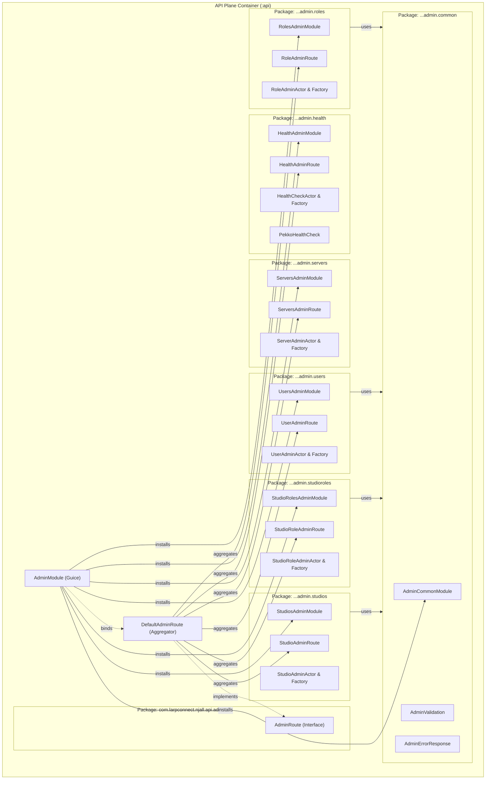

## Context

In **Njall**, the `:api` **library module** provides the HTTP routing layer. The `com.larpconnect.njall.api.admin` package houses the entire **Admin verticle** HTTP surface: 38 source files defining actor message protocols, actor behaviors, actor factories, HTTP routes, JSON request DTOs, and Guice configurations for 6 distinct administrative domains (health checks, server telemetry, studios, studio roles, users, and roles).

Under `AGENTS.md` and ADR-0011, **Njall** enforces a strict Directed Acyclic Graph (DAG) package structure where dependencies flow downward to subpackages or outward to sibling packages, but never upward to ancestor packages. In addition, each package layer must expose a public Guice **module** that installs its direct subpackage modules. Keeping all administrative components in a flat package hinders code discovery, obscures subcomponent boundaries, and mixes unrelated concerns.

## Goals / Non-Goals

**Goals:**
- Decompose `com.larpconnect.njall.api.admin` into 7 focused subpackages: `health`, `servers`, `studios`, `studioroles`, `users`, `roles`, and `common`.
- Equip every subpackage with a dedicated public Guice **module** and a `@NullMarked` `package-info.java`.
- Configure `AdminModule` to install subpackage modules (`HealthAdminModule`, `ServersAdminModule`, `StudiosAdminModule`, `StudioRolesAdminModule`, `UsersAdminModule`, `RolesAdminModule`, `AdminCommonModule`).
- Extract `HealthAdminRoute` and `ServersAdminRoute` so `DefaultAdminRoute` operates as a pure composite aggregator following IOSP-Lite.
- Isolate shared error responses (`AdminErrorResponse`) and validators (`AdminValidation`) in `com.larpconnect.njall.api.admin.common`, ensuring subpackages satisfy the ArchUnit invariant forbidding upward dependencies on ancestor packages.
- Move unit tests in `api/src/test/java/com/larpconnect/njall/api/admin/` into matching test subpackages.

**Non-Goals:**
- Modifying any external HTTP path, query parameter, request body schema, response code, or wire JSON format.
- Altering database persistence or business logic in **Actor** behavior execution.
- Creating separate Gradle subprojects (all packages remain within the `:api` **library module**).

## C4 Component Architecture

The following C4 component diagram illustrates the structure within the `:api` container:

### Architecture Highlights

- **Hierarchical Guice Wiring**: `AdminModule` acts exclusively as the aggregator **module** installing subpackage modules one level down.
- **Route Delegation**: `DefaultAdminRoute` is a pure IOSP-Lite integration class composing `concat(healthRoute.route(), serversRoute.route(), studioRoute.route(), ...)` without inlining HTTP handling logic.
- **Shared Utilities Isolation**: Placing `AdminValidation` and `AdminErrorResponse` in `...admin.common` enables lateral dependencies (`users` -> `common`) while preserving zero upward dependencies (`users` -/-> `admin`).

## Decisions

### Decision 1: Endpoint Plural Subpackage Taxonomy
- **Choice**: Structure subpackages as `health`, `servers`, `studios`, `studioroles`, `users`, `roles`, and `common`.
- **Rationale**: Aligns directly with OpenAPI route path segments (`/health`, `/servers`, `/studios`, `/studio-roles`, `/users`, `/roles`) and matches the plural convention established in `com.larpconnect.njall.api.studios`.
- **Alternatives Considered**:
  - *Domain singular* (`health`, `server`, `studio`, `studiorole`, `user`, `role`): Inconsistent with `com.larpconnect.njall.api.studios`.
  - *Keep flat in admin*: High cognitive load and violates modular package design.

### Decision 2: Dedicated HealthAdminRoute and ServersAdminRoute
- **Choice**: Extract `HealthAdminRoute` and `ServersAdminRoute` into `health` and `servers` subpackages.
- **Rationale**: In the legacy design, health check and server listing route handlers were embedded directly inside `DefaultAdminRoute`. Extracting dedicated route classes makes every subpackage uniform (each has its Route, **Actor**, Protocol, Factory, and **Module**) and ensures `DefaultAdminRoute` complies with IOSP-Lite by purely aggregating subroutes.
- **Alternatives Considered**:
  - *Keep inline in DefaultAdminRoute*: Leaves health and server route logic entangled in the root package while other domains have separate route classes.

### Decision 3: Subpackage Module Naming Convention
- **Choice**: Name subpackage modules with domain-specific admin suffixes: `HealthAdminModule`, `ServersAdminModule`, `StudiosAdminModule`, `StudioRolesAdminModule`, `UsersAdminModule`, `RolesAdminModule`, and `AdminCommonModule`.
- **Rationale**: Prevents name collisions with top-level or application modules (e.g., avoiding conflicts between `StudiosAdminModule` and `com.larpconnect.njall.api.studios.StudiosModule`, or `ServersAdminModule` and `com.larpconnect.njall.server.ServerModule`).
- **Alternatives Considered**:
  - *Short names* (`HealthModule`, `ServersModule`, `StudiosModule`): High risk of naming collision with application modules.

### Decision 4: Relocate Shared Elements to admin.common
- **Choice**: Place `AdminValidation`, `AdminErrorResponse`, and administrative `ObjectMapper` provider in `com.larpconnect.njall.api.admin.common`.
- **Rationale**: Subpackages `users`, `roles`, `studios`, and `studioroles` require shared validation and error models. If these remained in `com.larpconnect.njall.api.admin`, importing them would violate the ArchUnit `package_dependencies_must_not_go_up` rule. Moving them to sibling package `...admin.common` allows clean outward/lateral dependencies.
- **Alternatives Considered**:
  - *Duplicate classes per subpackage*: Violates DRY and complicates maintenance.
  - *Move to root common module (`:common`)*: Pollutes the shared common library with admin-specific HTTP DTOs.

## Risks / Trade-offs

- **[Risk] Broken Package-Private Visibility**: Route classes, actor factories, and helpers previously shared package-private visibility within `com.larpconnect.njall.api.admin`. Moving them to subpackages requires exposing interfaces or factory methods across package boundaries.
  - *Mitigation*: Expose only public interfaces (`HealthAdminRoute`, `ServersAdminRoute`, etc.) and Guice modules; keep implementation classes (`DefaultHealthCheckActorFactory`, `DefaultServerAdminActorFactory`) package-private inside their respective subpackages.
- **[Risk] Test Import Regressions**: Moving 38 source classes across packages will break existing test imports if not migrated systematically.
  - *Mitigation*: Move test classes into parallel subpackage directories (`api/src/test/java/com/larpconnect/njall/api/admin/<subpackage>/`) and update imports atomically.

## Migration Plan

1. Create subpackage directories under `api/src/main/java/com/larpconnect/njall/api/admin/` and corresponding test directories under `api/src/test/java/com/larpconnect/njall/api/admin/`.
2. Add `@NullMarked` `package-info.java` to each new subpackage.
3. Migrate shared models and validation into `...admin.common` with `AdminCommonModule`.
4. Migrate domain actors, commands, responses, factories, and routes into `health`, `servers`, `studios`, `studioroles`, `users`, and `roles`.
5. Extract `HealthAdminRoute` and `ServersAdminRoute` and wire them into `DefaultAdminRoute`.
6. Update `AdminModule` to install subpackage modules and bind aggregated routes.
7. Update test imports and verify via `./gradlew test` and ArchUnit architecture tests in `:integration`.

## Open Questions

None. All architectural decisions were clarified and resolved during the grill-me phase.
